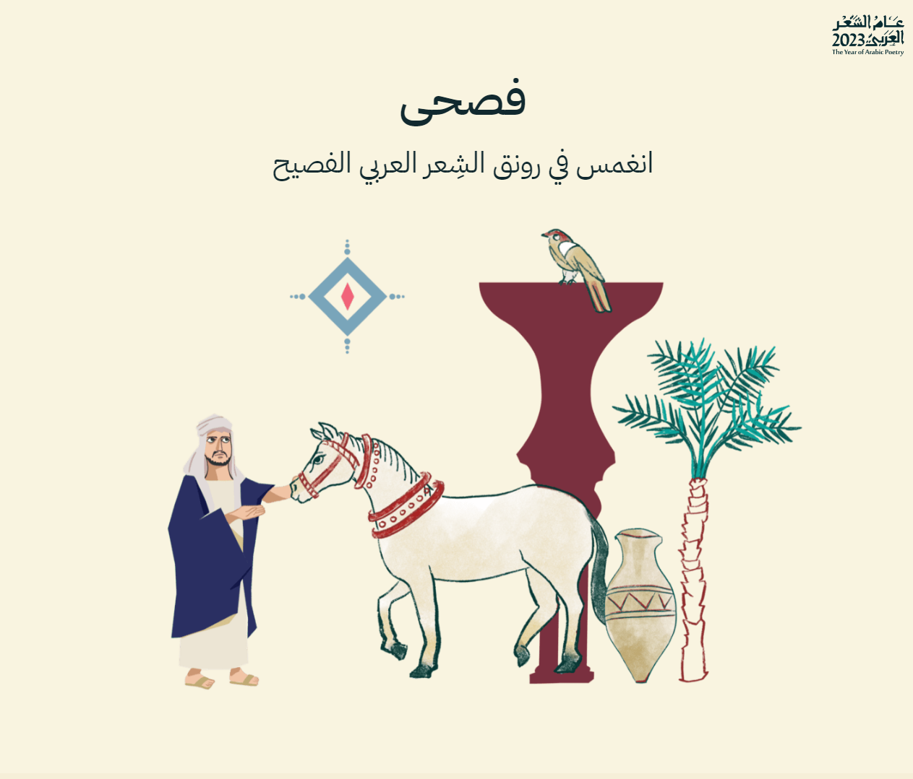

# Fusha ( فصحى ) - Arabic Poetry

  

## About Fusha ( فصحى ) 

Fusha is a simple poems library made with love for enthusiasts of classical Arabic poetry. We are passionate about collecting captivating and unique poetry from various poets across different eras.

It was made to celebrate the International Arabic Language Day and the Year of Arabic Poetry 2023

فصحى هي مكتبة شعرية بسيطة صُنعت بحب لعشاق الشعر العربي الفصيح. نحن مهتمون بجمع الأشعار المبهرة والفريدة لعدد من الشعراء من مختلف العصور، فتفضل بالاستمتاع برحلة ثقافية لا تُنسى في جمال الشعر العربي الفصيح. 

تم انشائه بمناسبة اليوم العالمي للغة العربية وعام الشعر العربي 2023

**Explore Fusha : https://fusha.vercel.app**
